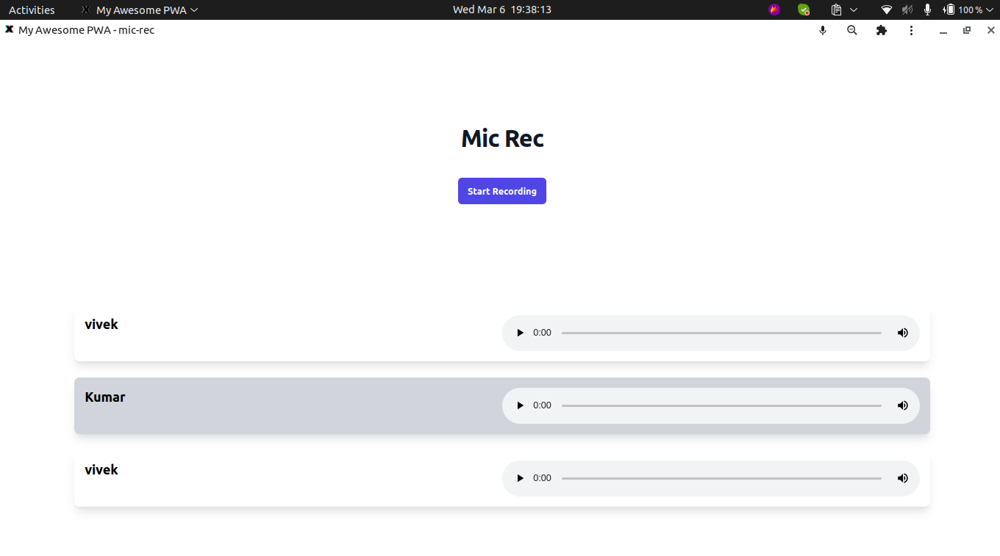

# mic-rec

## Requirements

1. Node 16

## Build Setup

```bash
# install dependencies
$ npm install

# serve with hot reload at localhost:3000
$ npm run dev

# build for production and launch server
$ npm run build
$ npm run start

```

## Steps

1. Run websocket server from https://github.com/firewall004/my-websockeet
2. Check and modify the port in both the repo accordingly

## Screenshot


