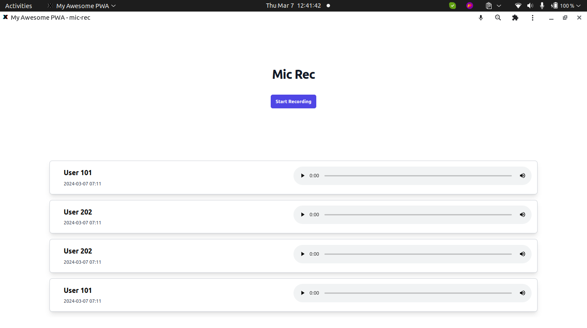

# mic-rec

## Requirements

1. Node 16

## Build Setup

```bash
# install dependencies
$ npm install

# serve with hot reload at localhost:3000
$ npm run dev

# build for production and launch server
$ npm run build
$ npm run start

```

## Steps

1. Run websocket server from [firewall004/my-websockeet](https://github.com/firewall004/my-websockeet) or [wiki/Websocket-Server](https://github.com/firewall004/Mic-Rec/wiki/Websocket-Server)
2. Copy `.env.example` to `.env` and modify the modify the port according to the websocket

## Screenshot


